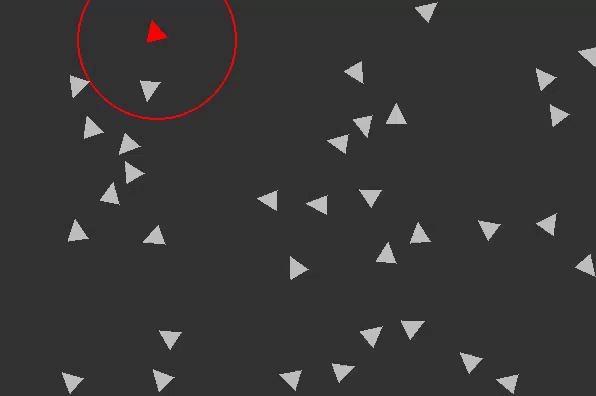
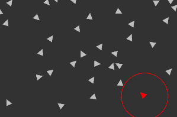
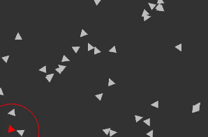

# 🐦 Boids Simulation

A Python-based exploration of the **Boids algorithm**, simulating flocking behaviors like flying or swarming patterns. This small project includes controls to dynamically create agents and toggle the behaviorial settings.

---

## 🎯 Features

- **Flocking Behaviors**:
  - **Separation**: Avoid crowding.
  - **Alignment**: Match the direction of neighbors.
  - **Cohesion**: Stay close to the group.
- **Bonus features**
  - **Randomness**: Adds a slight push in a random direction. (Enables more variation in the movement)
  - **Don't Avoid walls**: Will phase through walls and appear on the other side.
- **Customizable Settings**: Toggle behaviors and bonus features.
- **Dynamic Agent Creation**: Add new agents to the simulation with a button click.
- **Built with**:
  - [Python](https://www.python.org/)
  - [NumPy](https://numpy.org/)
  - [Pygame](https://www.pygame.org/)

---

🎮 **How to Use**
- Buttons:
  - Add new agents to the field.
  - On/Off Toggle for:
    - Separation
    - Alignment
    - Cohesion
    - Random wandering
    - Avoiding walls
- Visualization:
  - Boids are rendered with dynamic behaviors.
  - The first boid will be red and render its perception circle.

## 🌀 Boid Behaviors in Action

This small project demonstrates the three core behaviors of the Boids algorithm. Below are previews of each **individual** behavior:

### 1. **Separation**
Boids steer to avoid crowding their neighbors, maintaining individual space within the group.

---

### 2. **Alignment**
Boids align their direction with the average heading of nearby neighbors, creating coordinated group movement.

---

### 3. **Cohesion**
Boids move toward the average position of their neighbors, ensuring they stay close to the group.

